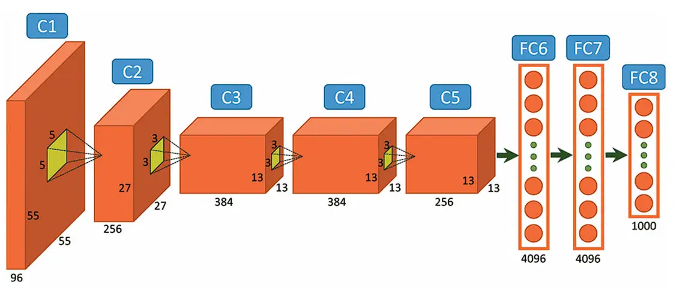
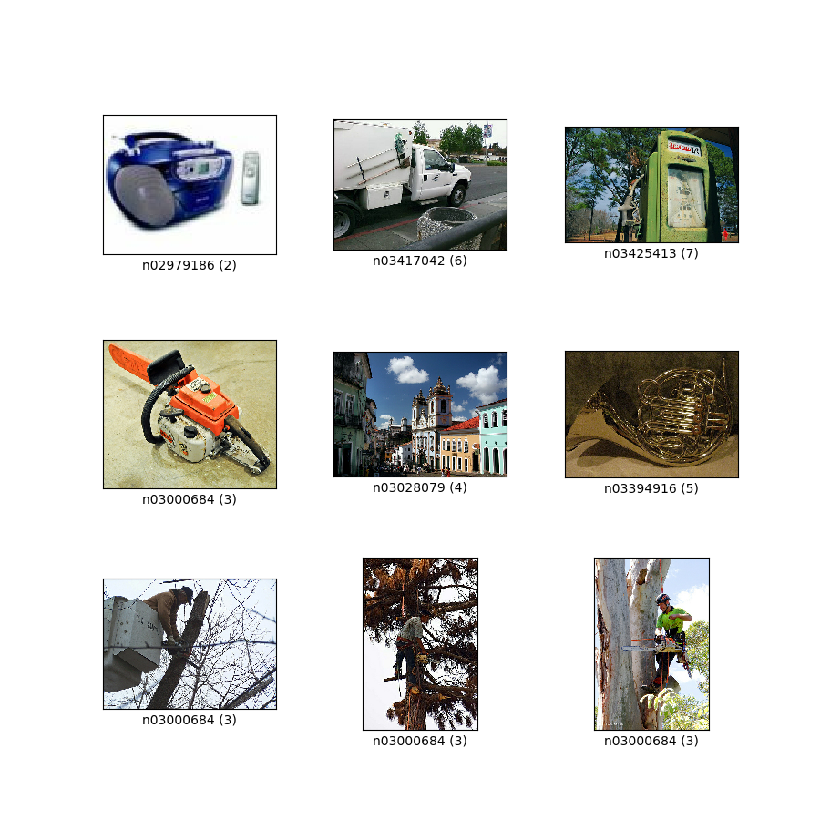
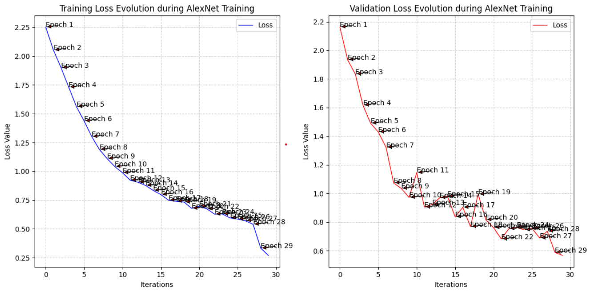

# AlexNet-from-scratch in PyTorch


My working in-depth implementation of Alex Krizhevsky, Ilya Sutskever, and Geoffrey Hinton's former state-of-the-art convolutional neural network. This is the second project from the Visual Scrambling series in which I reimplement from scratch the most influential classic architectures and ending with a unique visual model design written and designed by me.

Developed in 2012 and originally written in CUDA and C++, it won the **ImageNet Large Scale Visual Recognition Challenge** with an error rate of **15.3%**.

## Layout ##

```
├── IMAGES
│   ├── Alex Krizhevsky.png # photo of Alex Krizhevsky   
│   ├── alexNet-architecture.png # image of the AlexNet architecture    
│   ├── imagenette.png # image of Imagenette dataset labels
│   └── train_val_plot.png # visualization of training & validation loss curve
│  
├── src/            # model initialization code + weights
│   ├── __init__.py
│   ├── alexnet_model.pth # Git LFS pointer to the AlexNet trained model on Imagenette
│   └── model.py
│
├── LICENSE # the MIT License of the project
│
├── README.md           # the repository's showcase
│
├── requirements.txt
│
└── test.ipynb # model training + loss visualization + confusion matrix & classification report computation

```

## The architecture ##

Every layer is written out in **simple PyTorch** rather than pulled from a library, and the shapes are forced by the 3x224x224 (RGB) input:

| Layer | Operation | Output | Trainable params |
| --- | --- | --- | --- |
| Input | 3x224x224 RGB | `3 x 224 x 224` | — |
| **C1** | `Conv2d(3→96, 11x11, stride 4)` + ReLU  | `96 × 54 × 54` | 34,944 |
| **S2** | `MaxPool2d(3x3, stride 2)` | `96 x 26 x 26` | 0 |
| **C3** | `Conv2d(96→256, 5x5, pad 2)` + ReLU  | `256 x 26 x 26` | 614,656 |
| **S4** | `MaxPool2d(3x3, stride 2)` | `256 × 12 × 12` | 0 |
| **C5** | `Conv2d(256→384, 3x3, pad 1)` + ReLU  | `384 × 12 x 12` | 885,120 |
| **C6** | `Conv2d(384→384, 3x3, pad 1)` + ReLU  | `384 × 12 x 12` | 1,327,488 |
| **C7** | `Conv2d(384→256, 3x3, pad 1)` + ReLU  | `256 × 12 x 12` | 884,992 |
| **S8** | `MaxPool2d(3x3, stride 2)` | `256 x 5 x 5` | 0 |
| **F9** | `Linear(256x5x5=6400→4096)` + ReLU  | `4096` | 26,218,496 |
| **D9** | `Dropout(p=0.5)` | `-` | 0 |
| **F10** | `Linear(4096→4096)` + ReLU  | `4096` | 16,781,312 |
| **D10** | `Dropout(p=0.5)` | `-` | 0 |
| **Output-F11** | `Linear(4096->1000)` | `1000` classes for the original ImageNet classification task | 4,097,000 |
| | | **Total** | **50,844,008** |

## The Imagenette dataset


Some of the following information was taken from the [TensorFlow documentation](https://www.tensorflow.org/datasets/catalog/imagenette).

**Imagenette** is the benchmark this implementation was tested on — 13,394 images constitued from a subset of 10 easily classified classes from the Imagenet dataset. It was originally prepared by Jeremy Howard of FastAI. It was implemented mainly because running new ideas/algorithms/experiments on the whole Imagenet takes a lot of time.

The **10 Classes** of Imagenette span in the following order: Tench (fish), English springer (dog), Cassette player, Chain saw, Church, French horn, Garbage truck, Gas pump, Golf ball, Parachute.

| | Images | Size | Channels | Labels |
| --- | --- | --- | --- | --- |
| Train | 9,469 | roughly 3 x 469 × 387 | 3 (RGB) | 10 |
| Val | 3,925 | roughly 3 x 469 × 387 | 3 (RGB) | 10 |

### Experimental setup

The exact setup to reproduce the metrics the AlexNet-from-scratch in PyTorch model demonstrated were documented:

| Category | Setting |
| --- | --- |
| Hardware | `NVIDIA Tesla T4` |
| Software | `Python, PyTorch, torchvision` |
| Dataset | `Imagenette full size version` |
| Input | `3x224x224` |
| Epochs | `TBD` |
| Batch size | `TBD` |
| Optimizer | `SGD` |
| Learning Rate | `0.01` |
| Momentum | `0.9` |
| Weight decay | `0.0005` |
| Scheduler | `ReduceLROnPlateau(factor=0.1, patience=5)` |
| Dropout | `0.5` |
| Random Seed | `41` |
| Checkpoint | `src/alexnet_model.pth` |
| Runtime | `TBD` |

### Results



**83.26% validation accuracy** over 30 epochs on the [Imagenette dataset](https://github.com/fastai/imagenette) (in the included notebook run), having been trained with the notebook's loop over the full 9,469-image training split.

The full training run took roughly 20 minutes on a Free Colab T4 GPU.

The single accuracy figure is the least interesting output, though. [`test.ipynb`](test.ipynb) also produces a **confusion matrix** and a **per-class classification report** with precision, recall and F1 for each label.

Visualizing the **Classification Report**, a clear outlier was seen, that being the 3rd label (Cassette Player), the classifier reporting a precision of 68%, recall of 72%, and f1-score of 70% respectively.

For context, the original AlexNet achieved a top-5 error rate (percentage of test samples where a classification model's five most confident predictions do not include the correct label) of 15.3% on ImageNet. 

Training the **AlexNet-from-scratch** model and evaluating the metrics on ImageNet was out of the scope of this project, simply due to the size of ImageNet being ~144-155 GB and due to lack of compute power available. A possible expansion may be implemented in the near-future in which the model will be trained on a cloud instance and evaluated on larger datasets, such as the classical ImageNet.

That being said, I invite you to try and beat my score and train the model on other datasets and evaluate and plot the metrics, I recommend it do it by yourself with only the desired documentations available so that you can fully understand the training and evaluation process of CNNs and how this model processes data.

## Notes

* `model.py` follows the paper's implementation closely, but it is not a 1:1 reproduction — this is a learning repo, and the value is in the annotations and code writing and understanding of functionality, rather than rethinking outdated techniques of learning and optimization that do not apply to modern day CNN's (I say this even though I implemented some techniques from the original paper, such as the RBFSublayer, the [RBF loss computation](https://ieeexplore.ieee.org/document/9133368), and the custom decreasing learning rate over epochs)
* `test.ipynb` showcases the dataset extraction & visualization, model training loop, loss evolution visualization using matplotlib, confusion matrix computation between the true labels and the predicted ones, a classification report to showcase precision, accuracy, recall and f1-score between the digit classes (from 0-9), and finally a live inference script to observe real sampling and prediction, results I personally find fascinating to say the least

## Credits
 

Read more about AlexNet [here](https://en.wikipedia.org/wiki/AlexNet).

- Alex, K., Ilya, S., Bengio, Y., & Geoffrey, H. (2012). [ImageNet Classification with Deep Convolutional Neural Networks](https://papers.nips.cc/paper_files/paper/2012/file/c399862d3b9d6b76c8436e924a68c45b-Paper.pdf).

## Imagenette Citation

```
@misc{imagenette,
  author    = "Jeremy Howard",
  title     = "imagenette",
  url       = "https://github.com/fastai/imagenette/"
}
```

## Image Credits

Some visual assets used in this repository are sourced from Wikimedia Commons:

- **Alex Krizhevsky photograph** — [Source](https://www.artificial-intelligence.blog/people-in-ai/alex-krizhevsky).
- **AlexNet architecture image** — viso.ai blog article by Nico Klingler. Originally from [here](https://viso.ai/deep-learning/alexnet/).
- **Imagenette dataset representative image** — TensorFlow Datasets - [Source](https://www.tensorflow.org/datasets/catalog/imagenette).
  
These third-party images are **not covered by this repository's MIT License**. Their respective copyright and licensing terms continue to apply.

## 🔗 More

- Author: [Pop Alexandru](https://github.com/pop123-ux)
- Medium write-ups: [medium.com/@Pop123](https://medium.com/@Pop123)
- Hugging Face: [pop123ux](https://huggingface.co/pop123ux)
